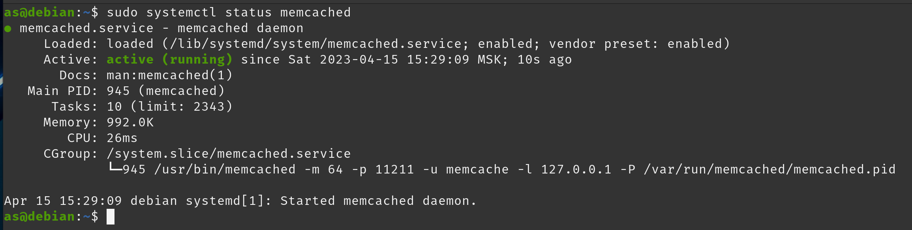
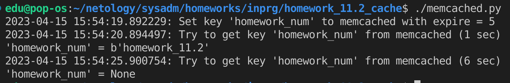
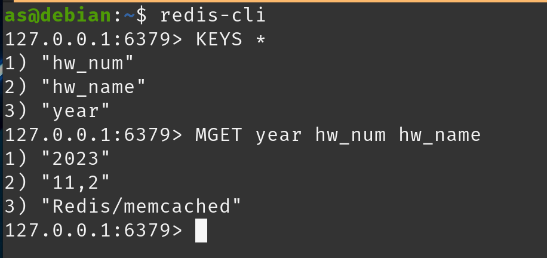
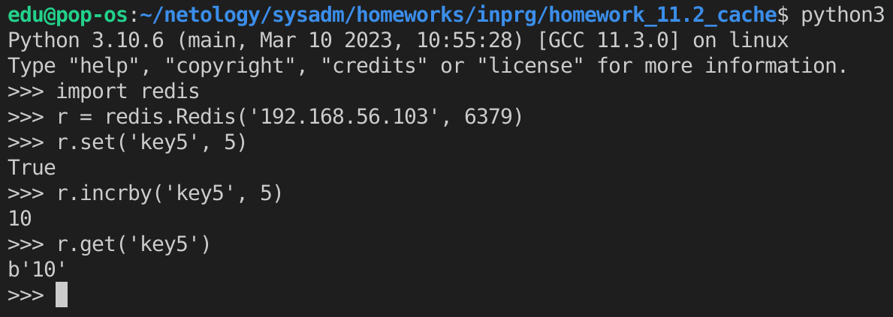

# Домашнее задание к занятию "11.2 - «Кеширование Redis/memcached»" - `Андрей Сотников`

---

### Задание 1. Кеширование

> Приведите примеры проблем, которые может решить кеширование.

Кэширование может:

* Увеличить общее быстродействие сервиса за счет уменьшения количества запросов к базе данных для получения одних и тех же данных
* Уменьшить нагрузку на базу данных
* Сгладить пики трафика
* Повысить скорость ответа за счет, например, кэшей, расположенных в различных географических точках

---

### Задание 2. Memcached

> Установите и запустите memcached.
>
> _Приведите скриншот `systemctl status memcached`, где будет видно, что memcached запущен._

---

### Задание 3. Удаление по TTL в Memcached

> Запишите в memcached несколько ключей с любыми именами и значениями, для которых выставлен TTL 5.
> _Приведите скриншот, на котором видно, что спустя 5 секунд ключи удалились из базы._

---

### Задание 4. Запись данных в Redis

> Запишите в Redis несколько ключей с любыми именами и значениями.
> _Через redis-cli достаньте все записанные ключи и значения из базы, приведите скриншот этой операции._

---

### Задание 5*. Работа с числами

> Запишите в Redis ключ key5 со значением типа "int" равным числу 5. Увеличьте его на 5, чтобы в итоге в значении лежало число 10.
> _Приведите скриншот, где будут проделаны все операции и будет видно, что значение key5 стало равно 10._

